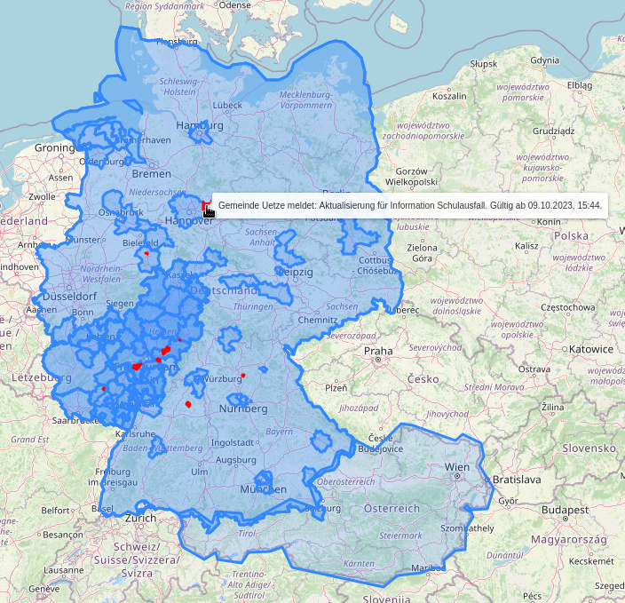

# Python API Client for KATWARN

NOTE: This is just a hobby project and not affiliated with KATWARN in any way.

On the national alert test day, when a test alert was displayed on the official
[KATWARN Austria](https://www.bmi.gv.at/204/katwarn/start.aspx) app, I wondered
if there was also a website where this data was displayed, and if there was any
kind of history to see what types of alerts are usually reported via KATWARN and
how often.

I couldn't find anything for Austria, but it turns out KATWARN provides a REST
API. So here is a simple API client, and also a GitHub action which regularly
dumps the API responses into git, so one can see a history of all alerts.

This is just a minimal implementation, feedback welcome.

```python
# pip install git+https://github.com/lazka/katwarn-api

from katwarn_api import KatWarnApi

api = KatWarnApi()
for entry in api.get_incidents().incidents:
    incident = api.get_incident(entry.id)
    for alert_id in incident.alerts:
        alert = api.get_alert(incident.id, alert_id)
        print(f"{entry.provider_id}: [{alert.event_code.value}] {alert.headline}")
```

## Examples

Print a map of all alerts (excluding topic alerts) via folium:

* `poetry install --with folium`
* `poetry run folium_example.py -o map.html`



Dump all resources to a JSON file:

* `poetry run dump.py -o dump.json`

List all service areas, topics, and alerts:

* `poetry run example.py`
